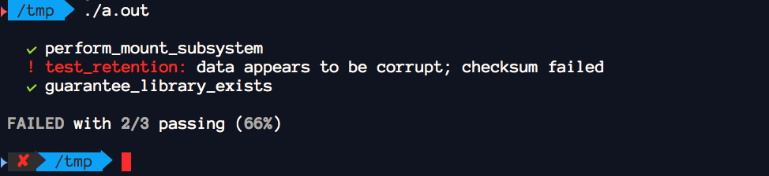

---

# QUnit
The simple yet beautiful unit testing framework.

Three macros. That's it.

I've also included a few assertion macros (check the header file).

## Usage

```c
#include "qunit.h"

const char *some_test(void) {
  if (true)
    return 0; /* success */
  else
    return "there was some sort of error"; /* error */
}

q_start();
q_test(some_test);
/* ... */
q_end();
```

# License
Released under [CC0](https://creativecommons.org/share-your-work/public-domain/cc0/). Go bananas.

[](https://creativecommons.org/share-your-work/public-domain/cc0/)
